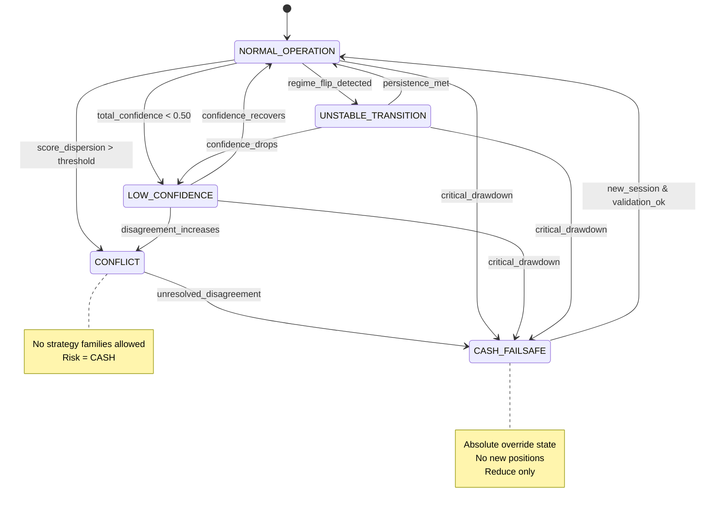
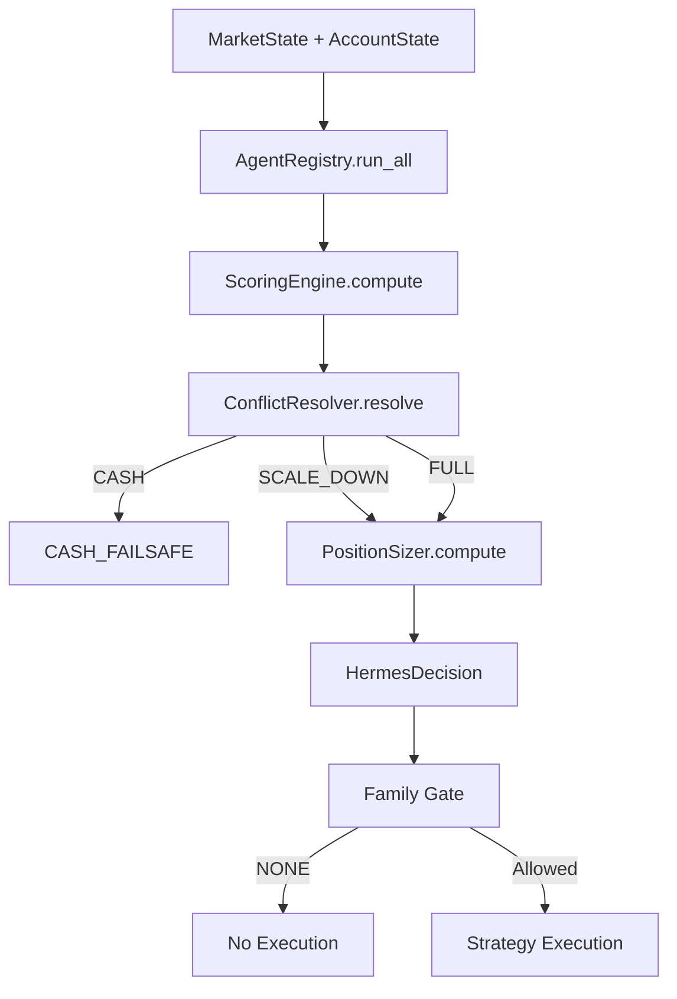

# Hermes v2 State & Flow Diagram — Ops & Audit

## Purpose

This document provides an operations- and audit-grade state/flow diagram for Hermes v2. It visualizes authority, decision flow, failure paths, and risk escalation boundaries. This diagram represents decision control, not price action.

This is a read-only behavioral map derived from docs 07 (World Model), 08 (HCR-001), and 09 (HPS-001).

---

## Conceptual Layers (Top → Bottom)

```
Market Data
   ↓
Agents (AMT / Wyckoff / Ichimoku / Volatility)
   ↓
Hermes Coordinator
   ├─ Scoring Engine
   ├─ Conflict Resolver (HCR-001)
   └─ Position Sizer (HPS-001)
   ↓
HermesDecision
   ↓
Strategy Families (Gate)
   ↓
Execution Layer (Strategies, Broker)
```

**Hermes never crosses downward into execution logic.**

---

## Hermes v2 State Diagram (Regime & Risk States)

### Mermaid State Diagram (Authoritative)



---

## State Definitions (Operational Meaning)

### NORMAL_OPERATION

- Agents aligned or acceptably noisy
- Confidence ≥ threshold
- No unresolved transitions
- Hermes may issue FULL or SCALE_DOWN directives

### LOW_CONFIDENCE

- Agent signals weak or partially misaligned
- Hermes enforces SCALE_DOWN
- Strategy family continuity preserved
- No risk escalation allowed

### UNSTABLE_TRANSITION

- Rapid regime score change detected
- Hermes freezes previous regime
- SCALE_DOWN enforced until persistence met

### CONFLICT

- Agent score dispersion exceeds limits
- Hermes invalidates regime
- Strategy family = NONE
- Forced exit path

### CASH_FAILSAFE

- Critical drawdown OR invalid input OR unresolved conflict
- Absolute authority override
- No trading permitted
- Exit only

---

## Decision Flow (Single Cycle)



---

## Non-Negotiable Transition Rules (Ops Critical)

1. **No escalation during session**
2. **CASH state overrides all others**
3. **Conflicts never vote; they halt**
4. **Regime changes require persistence**
5. **Sizing never bypasses conflict resolution**

---

## Audit Checklist (What Auditors Validate)

- [ ] Every HermesDecision maps to exactly one state
- [ ] Conflict always routes to CASH
- [ ] CASH state emits zero risk
- [ ] No state allows cross-family allocation
- [ ] All transitions are deterministic

---

## Diagram Authority

This diagram is authoritative for:

- Operations
- Risk governance
- EA conversion
- System audits

Any runtime behavior that violates this flow is a **defect**.

---

## Readiness Flag

`state_flow_diagram: COMPLETE`